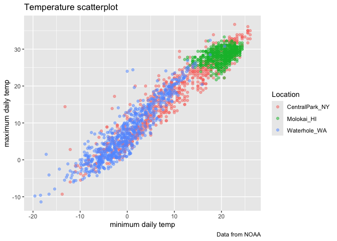
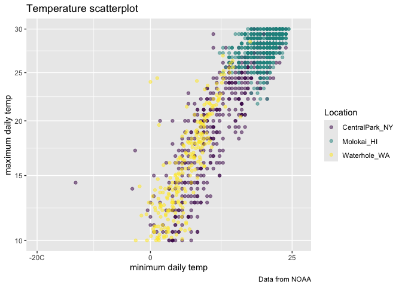
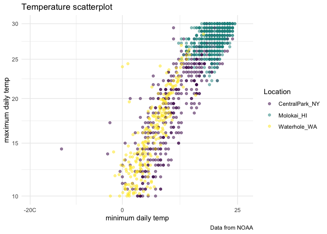
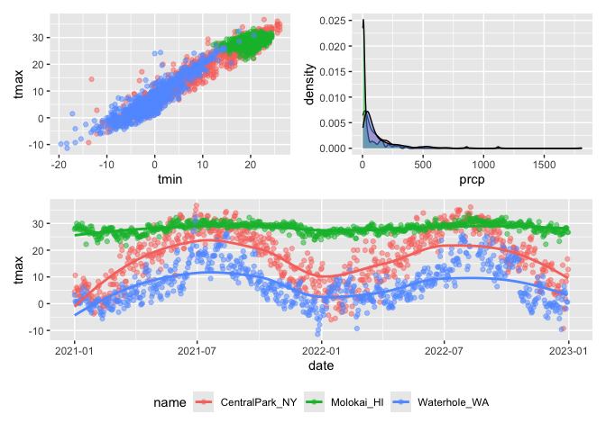
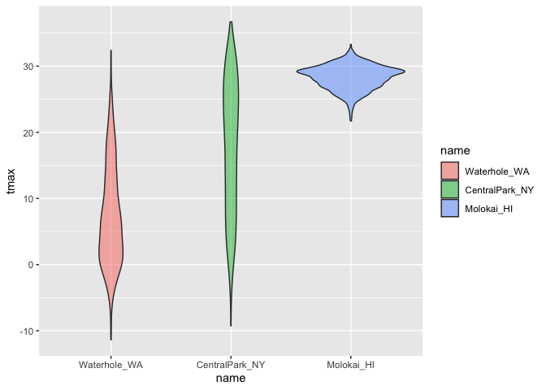

Visualization 2
================
2025-09-30

``` r
library(tidyverse)
```

    ## ── Attaching core tidyverse packages ──────────────────────── tidyverse 2.0.0 ──
    ## ✔ dplyr     1.1.4     ✔ readr     2.1.5
    ## ✔ forcats   1.0.0     ✔ stringr   1.5.1
    ## ✔ ggplot2   3.5.2     ✔ tibble    3.3.0
    ## ✔ lubridate 1.9.4     ✔ tidyr     1.3.1
    ## ✔ purrr     1.1.0     
    ## ── Conflicts ────────────────────────────────────────── tidyverse_conflicts() ──
    ## ✖ dplyr::filter() masks stats::filter()
    ## ✖ dplyr::lag()    masks stats::lag()
    ## ℹ Use the conflicted package (<http://conflicted.r-lib.org/>) to force all conflicts to become errors

``` r
library(patchwork)
library(p8105.datasets)
library(viridis)
```

    ## Loading required package: viridisLite

``` r
data("weather_df")
```

Let’s make our basic scatterplot \##labs( adds labels to graph

``` r
weather_df |>
  ggplot(aes(x=tmin, y=tmax)) +
  geom_point(aes(color = name), alpha =0.5) +
  labs(
    x= "minimum daily temp",
    y= "maximum daily temp",
    title = "Temperature scatterplot",
    caption = "Data from NOAA",
    color = "Location"
  )
```

    ## Warning: Removed 17 rows containing missing values or values outside the scale range
    ## (`geom_point()`).

<!-- -->

\##scales: can change scale by x or y axis limits zooms into only a
section of the plot that you care about.Scale_clor_hue changes color
scheme, but Jeff wants us to use the “virdis” package instead because
it’s “friendlier”?

``` r
weather_df |>
  ggplot(aes(x=tmin, y=tmax)) +
  geom_point(aes(color = name), alpha =0.5) +
  labs(
    x= "minimum daily temp",
    y= "maximum daily temp",
    title = "Temperature scatterplot",
    caption = "Data from NOAA",
    color = "Location"
  ) +
  scale_x_continuous(
    breaks = c(-20, 0, 25),
    labels = c("-20C", "0", "25")
  ) +
  scale_y_continuous(
    trans= "sqrt",
    limits = c(10,30)
  ) +
  viridis::scale_color_viridis(
    discrete = TRUE
  )
```

    ## Warning in transformation$transform(x): NaNs produced

    ## Warning in scale_y_continuous(trans = "sqrt", limits = c(10, 30)): sqrt
    ## transformation introduced infinite values.

    ## Warning: Removed 843 rows containing missing values or values outside the scale range
    ## (`geom_point()`).

<!-- -->

\##save a big code chunk as a name called ggp_temperature so you dont
have to tyoe it out. Could also use ggsave to save the scatterplot

``` r
ggp_temperature =
  weather_df |>
  ggplot(aes(x=tmin, y=tmax)) +
  geom_point(aes(color = name), alpha =0.5) +
  labs(
    x= "minimum daily temp",
    y= "maximum daily temp",
    title = "Temperature scatterplot",
    caption = "Data from NOAA",
    color = "Location"
  ) +
  scale_x_continuous(
    breaks = c(-20, 0, 25),
    labels = c("-20C", "0", "25")
  ) +
  scale_y_continuous(
    trans= "sqrt",
    limits = c(10,30)
  ) +
  viridis::scale_color_viridis(
    discrete = TRUE
  )
```

\##theme minimal does white background with grey lines

``` r
ggp_temperature +
  theme_minimal()+
  theme(lgend.position="bottom")
```

    ## Warning in transformation$transform(x): NaNs produced

    ## Warning in scale_y_continuous(trans = "sqrt", limits = c(10, 30)): sqrt
    ## transformation introduced infinite values.

    ## Warning in plot_theme(plot): The `lgend.position` theme element is not defined
    ## in the element hierarchy.

    ## Warning: Removed 843 rows containing missing values or values outside the scale range
    ## (`geom_point()`).

<!-- -->

\##Adding data in geoms

``` r
central_park_df =
  weather_df |>
  filter(name == "CentralPark_NY")

molokai_df =
  weather_df |>
  filter(name == "Molokai_HI")

ggplot(data = molokai_df, aes(x = date, y= tmax, color = name)) +
  geom_point()+
  geom_line(data = central_park_df)
```

    ## Warning: Removed 1 row containing missing values or values outside the scale range
    ## (`geom_point()`).

<!-- -->

\##patchwork: Make three plots and combine using patchwork to squeeze
multiple plots in the same panel to have a lot of info without taking up
a lot of space

``` r
ggp_tmax_tmin =
  weather_df |>
  ggplot(aes(x=tmin, y=tmax, color=name)) +
  geom_point(alpha = 0.5) +
  theme(legend.position = "none")

ggp_prec_density =
  weather_df |>
  filter(prcp >0) |>
  ggplot (aes(x =prcp, fill = name)) +
  geom_density(alpha = 0.5) +
  theme(legend.position = "none")

ggp_temp_season =
  weather_df |>
  ggplot(aes(x=date, y=tmax, color = name)) +
  geom_point(alpha = 0.5) +
  geom_smooth(se=FALSE) +
  theme(legend.position = "bottom")

(ggp_tmax_tmin + ggp_prec_density) / ggp_temp_season
```

    ## Warning: Removed 17 rows containing missing values or values outside the scale range
    ## (`geom_point()`).

    ## `geom_smooth()` using method = 'loess' and formula = 'y ~ x'

    ## Warning: Removed 17 rows containing non-finite outside the scale range
    ## (`stat_smooth()`).
    ## Removed 17 rows containing missing values or values outside the scale range
    ## (`geom_point()`).

<!-- -->

\##Data manipulation Let’s make temperature violin plots. Factor relevel
assigns molokai, cp, and waterhole in the order you want

``` r
weather_df |>
  mutate(name = fct_relevel(name, c("Molokai_HI", "CentralPark_NY", "Waterhole_WA"))) |>
  
  ggplot(aes(x=name, y=tmax, fill=name))+
  geom_violin(alpha = 0.5)
```

    ## Warning: Removed 17 rows containing non-finite outside the scale range
    ## (`stat_ydensity()`).

<!-- -->

``` r
weather_df |>
  mutate(name = fct_reorder(name, tmax)) |>
  ggplot(aes(x=name, y=tmax, fill = name)) +
  geom_violin(alpha = 0.5)
```

    ## Warning: There was 1 warning in `mutate()`.
    ## ℹ In argument: `name = fct_reorder(name, tmax)`.
    ## Caused by warning:
    ## ! `fct_reorder()` removing 17 missing values.
    ## ℹ Use `.na_rm = TRUE` to silence this message.
    ## ℹ Use `.na_rm = FALSE` to preserve NAs.

    ## Warning: Removed 17 rows containing non-finite outside the scale range
    ## (`stat_ydensity()`).

<!-- -->

``` r
pulse_df =
  haven::read_sas("data/public_pulse_data.sas7bdat") |>
  janitor::clean_names() |>
  pivot_longer(
    bdi_score_bl :bdi_score_12m,
    names_to = "visit",
    names_prefix = "bdi_score_",
    values_to = "bdi"
  ) |>
  mutate(visit = fct_inorder(visit))

pulse_df |>
  ggplot(aes(x=visit, y=bdi)) +
  geom_boxplot()
```

    ## Warning: Removed 879 rows containing non-finite outside the scale range
    ## (`stat_boxplot()`).

<!-- -->
